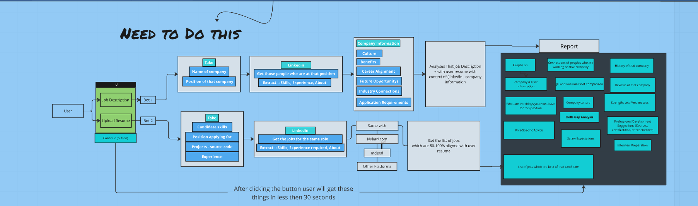

# Resume Analysis and Job Matching System

  

This project aims to assist users in applying for jobs by providing detailed analysis and reports based on their uploaded resumes and job descriptions.

### 1. Install `ResumeXpert`:
- Visit the [quickstart section](installations.md#%EF%B8%8F-quickstart) of Understanding of Project.

## Current Features

### User Interface
- Upload Resumes
- Input Job Descriptions
### Backend Processing
- **Resume Parsing:** Extracts relevant information from the resume.
- **Job Description Analysis:** Extracts key details from the job description.
- **Matching Engine:** Compares resume data with job description data.
- **Report Generation:** Compiles the findings into a comprehensive report.

### Report
- Provides detailed analysis and insights based on the resume and job description.

## Planned Features

### New Features to Implement

1. **Extended User Interface**
   - Enhanced UI for better user experience.
   - Additional input fields for more detailed job descriptions.

2. **Data Extraction and Integration**
   - **Taleo Integration:** Extract company information, job position, and company details.
   - **LinkedIn Integration:** Get details of people currently in the job position being applied for (skills, experience, about).
   - **Tasks Integration:** Candidate skills and experience extraction from tasks applied for.

3. **Detailed Analysis**
   - **Company Information:** Collects details about the company including history, culture, and career alignment.
   - **Career Alignment:** Assesses how well the user's resume aligns with the desired career path.
   - **Industry Connection:** Provides information on how the job fits within the broader industry.
   - **Application Requirements:** Lists out specific requirements for the application process.

4. **Report Enhancements**
   - **In-depth Job Description Analysis:** Analyzes the job description in the context of the user's resume.
   - **Skill Gap Analysis:** Identifies gaps in the user's skills relative to the job requirements.
   - **Salary Insights:** Provides salary expectations and comparisons.
   - **Future Opportunities:** Highlights future growth opportunities within the company and industry.
   - **Candidate Strengths and Weaknesses:** Summarizes the candidate’s strengths and areas for improvement.
   - **Interview Preparation:** Offers tips and resources for interview preparation.

5. **Performance**
   - The system aims to provide all the required information to the user in less than 30 seconds after clicking the button.

## Implementation Plan

1. **User Interface Enhancements**
   - Design and implement a more intuitive and user-friendly interface.

2. **Backend Integrations**
   - Develop and integrate APIs for Taleo, LinkedIn, and other platforms for real-time data extraction.

3. **Data Processing and Analysis**
   - Implement advanced data processing algorithms to handle new data inputs and provide deeper analysis.

4. **Report Generation Enhancements**
   - Upgrade the report generation module to include new analysis features and present the information in a clear, actionable format.

5. **Performance Optimization**
   - Optimize the system’s performance to ensure rapid data processing and report generation.

You can view the interactive component on Miro by clicking [here](https://miro.com/welcomeonboard/NmVKY1cwQUlhY3JhYWphNXlIQ1VqNnhhN1hLRDZJWmE0cWczUWM2S3JWZFRIZExuNkkydzZGdGRISnFNOUxMNnwzNDU4NzY0NTY3NDA3MDI5OTU0fDI=?share_link_id=262308642756).

[Visit Miro Board](https://miro.com/welcomeonboard/NmVKY1cwQUlhY3JhYWphNXlIQ1VqNnhhN1hLRDZJWmE0cWczUWM2S3JWZFRIZExuNkkydzZGdGRISnFNOUxMNnwzNDU4NzY0NTY3NDA3MDI5OTU0fDI=?share_link_id=563417039097)

